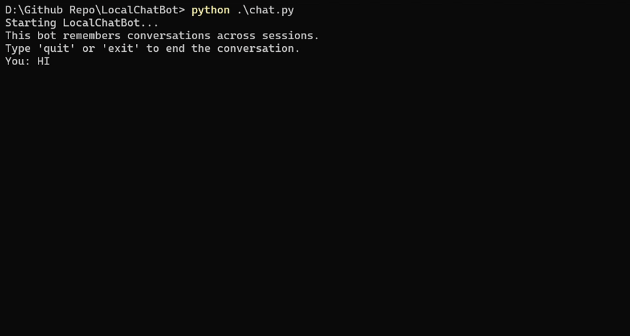

# Local Chatbot with Persistent Memory (local-chatbot-memory)

This project is a Python-based console chatbot that runs locally using Ollama and features persistent memory, allowing it to remember details from previous conversations.

## Features

*   **Local Execution:** Runs entirely on your machine using Ollama. No cloud dependencies.
*   **Persistent Memory:** Remembers facts and context across different chat sessions.
*   **Retrieval-Augmented Generation (RAG):** Uses embeddings and a vector store to retrieve relevant past conversation snippets to inform current responses.
*   **Configurable LLMs:** Easily change the generation and embedding models served by Ollama.
*   **Console-Based:** Simple and clean command-line interface.


## System Requirements

| Component            | Minimum Recommended                                  |
| :----------------    | :--------------------------------------------------- |
| **Operating System** | Windows 10/11, macOS, Linux                          |
| **Python**           | 3.8+ (Tested with 3.10)                              |
| **RAM**              | >= 8 GB                                              |
| **GPU**              | NVIDIA GPU with >= 4GB VRAM                          |
| **Storage**          | ~10-20 GB free space(For storing models)             |
| **Software**         | [Ollama](https://ollama.com/) installed and running  |


## Demo



## Setup

1.  **Clone the repository:**
    ```bash
    git clone https://github.com/Prathmesh597/local-chatbot-with-memory.git
    cd local-chatbot-with-memory
    ```

2.  **Install Ollama:** Follow the instructions at [https://ollama.com/](https://ollama.com/).

3.  **Pull necessary Ollama models:**
    ```bash
    ollama pull gemma2:2b  # Recommended generation model
    ollama pull mxbai-embed-large:335m-v1-fp16 # Recommended embedding model
    ```
    *(Ensure the model names in `ollama_interface.py` match what you've pulled).*

4.  **Install Python dependencies:**
    ```bash
    pip install -r requirements.txt
    ```

5.  **Run the chatbot:**
    ```bash
    python chat.py
    ```

## To Clear Memory

To reset the chatbot's memory (if you are not ignoring these files in `.gitignore` and they exist):
1.  Delete `memory/history.jsonl`.
2.  Delete the `memory/vector_db/` directory.
The scripts will recreate these on the next run.
